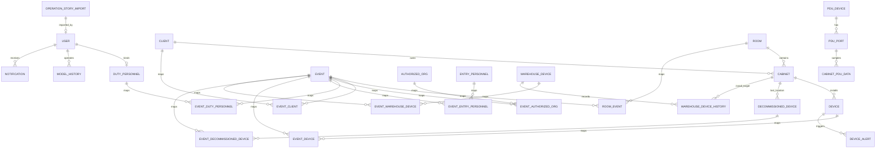

# 数据库设计

## 1. 设计目标

RackOps CMDB 的数据模型围绕三类核心业务展开：

- 资产管理：机房、机柜、在用设备、下架设备、仓库设备
- 事件管理：运维事件、进场人员、客户、授权单位、值班人员
- 弱电监控：PDU 设备、PDU 端口、端口级采集数据

系统同时要求支持：

- 业务主数据与弱电采集数据分库
- 事件驱动的资产流转
- 变更审计与回退
- 报表统计与批量导入导出

## 2. 数据库拆分

项目使用两个 PostgreSQL 数据库：

| 数据库 | 用途 | 主要模型 |
| --- | --- | --- |
| `default` | 主业务库 | `User`、`Client`、`DutyPersonnel`、`Room`、`Cabinet`、`Device`、`Event`、`WarehouseDevice`、`Notification` 等 |
| `pdu` | 弱电数据专用库 | `PDUDevice`、`PDUPort`、`CabinetPDUData` |

### 分库原因

- `CabinetPDUData` 数据量增长快，适合与主业务库隔离
- PDU 采集与导入读写频率高，不希望影响核心业务表
- 便于后续按弱电场景独立扩容或归档

### 路由规则

数据库路由定义在 [backend/cmdb_project/database_router.py](../backend/cmdb_project/database_router.py)：

- `PDUDevice`
- `PDUPort`
- `CabinetPDUData`

这三类模型固定走 `pdu` 数据库，其余模型走 `default`。

## 3. 逻辑模型总览

说明：

- 图中 `EVENT_*`、`ROOM_EVENT` 为事件域的多对多中间表
- `PDU` 模型和 `Room` / `Cabinet` 的关联是逻辑关联，不是跨库外键
- `ModelHistory` 记录业务模型变更，`Notification` 记录站内消息

## 4. 核心实体设计

## 4.1 用户与权限域

### `auth_user`

自定义用户表，对应 `users.User`。

核心字段：

- `username`
- `email`
- `first_name`
- `last_name`
- `is_active`
- `is_staff`
- `is_superuser`
- `date_joined`
- `last_login`

设计说明：

- 认证采用 JWT
- 管理员权限通过 `is_staff` / `is_superuser` 控制

### `duty_personnel`

值班人员业务资料，与用户表一对一关联。

核心字段：

- `employee_id`
- `name`
- `id_card`
- `phone`
- `type`
- `user`
- `account_status`
- `approved_by`
- `approved_at`
- `rejection_reason`

设计说明：

- 值班人员注册走审核流程
- 审核结果会同步用户激活状态并生成站内通知

## 4.2 主数据域

### `client`

客户主数据。

核心字段：

- `name`
- `authorized_person`

### `authorized_org`

授权单位主数据。

核心字段：

- `name`

### `room`

机房主数据。

核心字段：

- `name`

### `cabinet`

机柜主数据。

核心字段：

- `name`
- `room`
- `client`

设计说明：

- 一个机房包含多个机柜
- 机柜可选绑定客户

## 4.3 资产域

### `device`

在用设备表。

核心字段：

- `brand`
- `model`
- `sn`
- `u_size`
- `rack_position`
- `power_type`
- `power_wattage`
- `device_type`
- `cabinet`

设计说明：

- `sn` 建索引，便于检索与导入匹配
- 与 `Event` 通过 `event_device` 中间表关联

### `decommissioned_device`

下架设备表。

核心字段：

- `sn`
- `brand`
- `model`
- `u_size`
- `rack_position`
- `power_type`
- `cabinet`
- `decommission_reason`
- `status`

设计说明：

- 保留下架前的机柜位置
- 下架时间不直接存字段，而是从关联事件推导

### `warehouse_device`

仓库设备表，用于代收、待上架、已出库设备管理。

核心字段：

- `brand`
- `model`
- `sn`
- `u_size`
- `power_type`
- `power_wattage`
- `device_type`
- `supplier`
- `collection_time`
- `warehouse_location`
- `status`
- `notes`

### `warehouse_device_history`

仓库设备操作历史。

核心字段：

- `warehouse_device`
- `action`：`in` / `install` / `out` / `update`
- `action_date`
- `action_time`
- `install_location`
- `install_rack_position`
- `cabinet`
- `event`
- `operator`

设计说明：

- 记录仓库流转链路
- 与 `WarehouseDevice` 一对多

### `device_alert`

设备告警表。

核心字段：

- `title`
- `description`
- `level`
- `status`
- `discovered_at`
- `duty_personnel`
- `resolved_at`
- `resolution_notes`
- `device`

设计说明：

- 支持 Excel 模板导入与导出
- 状态覆盖新增、确认、解除、关闭

## 4.4 事件域

### `event`

运维事件主表。

核心字段：

- `date`
- `start_time`
- `end_time`
- `completion_status`
- `order_number`
- `description`

设计说明：

- 事件是业务联动核心
- 一条事件可关联机房、客户、授权单位、值班人员、进场人员、设备、仓库设备、下架设备

### `entry_personnel`

进场人员表。

核心字段：

- `name`
- `id_card`
- `contact_info`

### 事件中间表

| 表名 | 作用 |
| --- | --- |
| `room_event` | 事件与机房 |
| `event_client` | 事件与客户 |
| `event_authorized_org` | 事件与授权单位 |
| `event_duty_personnel` | 事件与值班人员 |
| `event_entry_personnel` | 事件与进场人员 |
| `event_device` | 事件与在用设备 |
| `event_decommissioned_device` | 事件与下架设备 |
| `event_warehouse_device` | 事件与仓库设备 |

设计说明：

- 事件域采用“主表 + 多个中间表”设计，避免宽表堆叠
- 中间表大多带唯一约束，避免重复关联

### `operation_story_import`

运维故事导入记录表。

核心字段：

- `batch_id`
- `import_time`
- `imported_by`
- `event_count`
- `device_count`
- `skipped_events`
- `skipped_devices`
- `incremental`
- `summary`
- `event_ids`
- `device_sns`
- `rolled_back`

设计说明：

- 用于承接 Excel 导入、预览、回滚能力
- 可追踪导入批次与回滚状态

## 4.5 配置与审计域

### `system_config`

系统配置表。

核心字段：

- `key`
- `value`
- `category`
- `description`

配置分类：

- `alert_thresholds`
- `display_settings`
- `pdu_report`

### `model_history`

模型变更历史表。

核心字段：

- `content_type`
- `object_id`
- `action`
- `changed_by`
- `duty_personnel`
- `is_admin_action`
- `changed_at`
- `old_data`
- `new_data`
- `changed_fields`
- `m2m_changes`
- `field_labels`
- `reverted`

设计说明：

- 支持对象级、字段级、多对多级审计
- 支持管理员回退与批量回退

### `notification`

站内通知表。

核心字段：

- `recipient`
- `notification_type`
- `title`
- `content`
- `is_read`
- `created_at`
- `read_at`
- `related_content_type`
- `related_object_id`

## 4.6 PDU 域

### `pdu_device`

PDU 设备表，存放在 `pdu` 库。

核心字段：

- `device_id`
- `device_name`
- `circuit_type`
- `room_id`
- `room_name`
- `total_ports`
- `auto_collect_enabled`
- `collect_interval`

设计说明：

- `room_id` 是逻辑关联字段，对应主业务库中的 `room.id`
- 不直接建立跨库外键

### `pdu_port`

PDU 端口表，存放在 `pdu` 库。

核心字段：

- `pdu_device`
- `port_number`
- `port_identifier`
- `cabinet_id`
- `cabinet_name`
- `status`

设计说明：

- `port_identifier` 唯一
- `(pdu_device, port_number)` 唯一
- `cabinet_id` 逻辑关联主库中的 `cabinet.id`

### `cabinet_pdu_data`

端口级弱电采集数据表，存放在 `pdu` 库。

核心字段：

- `pdu_port`
- `data_type`
- `value`
- `unit`
- `timestamp`
- `source`
- `import_batch`
- `quality`
- `created_at`
- `updated_at`

数据类型：

- `current`
- `power`
- `energy`
- `thd_current`
- `switch_status`

设计说明：

- 核心唯一约束：`(pdu_port, data_type, timestamp, source)`
- 支持 API 自动采集和人工导入
- 单独做时间范围、批次、来源、多字段组合索引

## 5. 关键业务关系

## 5.1 事件驱动设备流转

- 在用设备通过 `event_device` 绑定到事件
- 下架设备通过 `event_decommissioned_device` 绑定到事件
- 仓库设备通过 `event_warehouse_device` 绑定到事件

这让“某次运维动作涉及哪些设备”可以从事件维度统一回溯。

## 5.2 仓库到上架的转换

仓库设备上架时：

1. `warehouse_device.status` 更新为 `installed`
2. 创建新的 `device`
3. 写入 `warehouse_device_history(action=install)`
4. 可选关联到 `event`

## 5.3 PDU 与机柜的逻辑关联

PDU 域不直接依赖主库外键，而使用：

- `PDUDevice.room_id` / `room_name`
- `PDUPort.cabinet_id` / `cabinet_name`

这样可以在分库前提下仍然完成：

- 机柜维度的端口查询
- 多机柜批量聚合最新功率
- 报表按客户 / 机柜 / 机房维度汇总

## 6. 索引与约束策略

项目中比较重要的索引和约束包括：

- `Device.sn`：设备快速定位
- `Event.order_number`：订单号查询
- `ModelHistory(content_type, object_id)`：对象级审计回溯
- `Notification(recipient, is_read)`：未读消息统计
- `PDUPort.port_identifier`：端口定位
- `CabinetPDUData(pdu_port, data_type, timestamp)`：时序查询
- `CabinetPDUData` 唯一约束：避免重复采集/重复导入

## 7. 当前设计特点

### 优点

- 业务域划分清晰
- 事件模型中心化，便于做审计和报表
- PDU 数据分库，便于扩展
- 历史回退、通知、系统配置较完整

### 需要注意的地方

- PDU 与主业务库之间是逻辑关联，不是数据库强约束
- `DecommissionedDevice` 没有独立 `device_type` / `power_wattage` 字段，部分导出场景会受限
- 事件域中间表较多，做联表统计时要注意预加载和去重

## 8. 建议的后续演进

- 为跨库逻辑关联增加定时校验任务，避免 `room_id` / `cabinet_id` 漂移
- 给常用查询补充更明确的唯一约束或业务键
- 若 PDU 数据持续增长，可考虑分区表或冷热分层
- 报表若需留痕，可补 `ReportTask` / `ReportFile` 持久化模型
